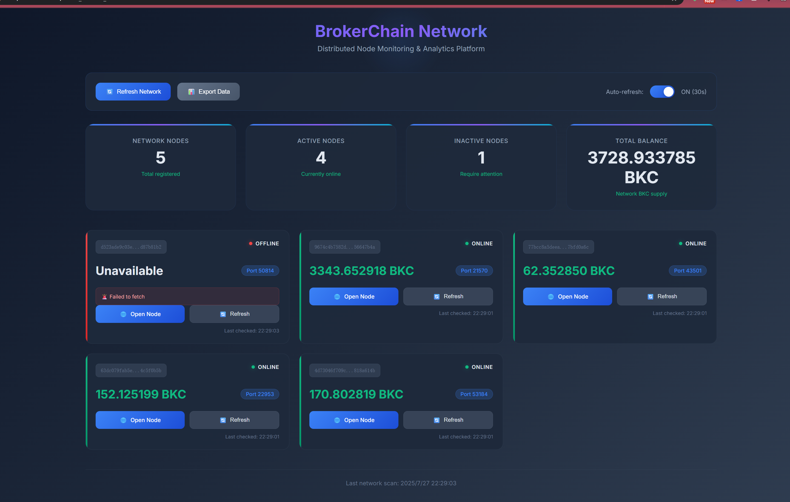

# BrokerChain Network Wallet Monitor

A real-time monitoring dashboard for BrokerChain network wallets, displaying node status, balances, and network analytics.



## Features

- **Real-time monitoring** of multiple wallet nodes
- **Network status overview** with active/inactive node counts
- **Balance tracking** across all connected wallets
- **Auto-refresh** capability with configurable intervals
- **Export functionality** for data analysis
- **Responsive dashboard** with dark theme UI

## Installation

```bash
npm install
```

## Usage

### API Mode (Server Mode) - Recommended

1. Install dependencies:
   ```bash
   npm install
   ```

2. Start the server:
   ```bash
   npm start
   ```

3. Open your browser and visit:
   ```
   http://localhost:8099
   ```

### Local Mode (Direct HTML)

1. Generate configuration:
   ```bash
   # On Windows
   generate_config.bat
   
   # On Linux/Mac
   ./generate_config.sh
   ```

2. Open `wallet_monitor_auto.html` in your browser

## Configuration

**Important**: The `wallet_monitor` directory should be placed at the same level as your wallet URL files:
```
parent_directory/
├── wallet_monitor/
└── The browser wallet URL of account [address].txt
```

The application automatically scans for wallet URL files and generates the configuration.

## API Endpoints

- `GET /api/wallets` - List all configured wallets
- `GET /api/wallet/:address/balance` - Get specific wallet balance
- `GET /api/network/status` - Get complete network status

## License

MIT License - see [LICENSE](LICENSE) file for details.
